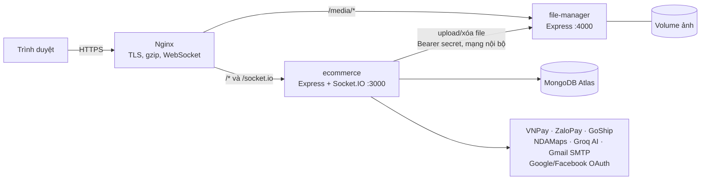
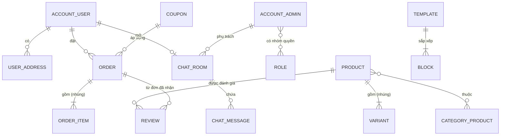
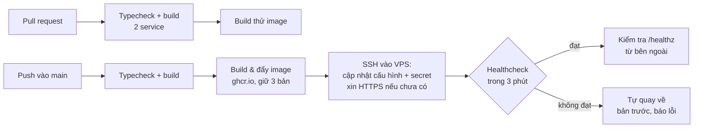

# Questa — Hệ thống thương mại điện tử thời trang nam

**Demo:** https://quangtm.site &nbsp;·&nbsp; **Tác giả:** Trần Minh Quang — Backend / Fullstack Developer

Website bán hàng hoàn chỉnh gồm **cửa hàng cho khách**, **trang quản trị**, **chat realtime có AI hỗ trợ**
và **một service quản lý file tách riêng**. Hệ thống tích hợp thanh toán (VNPay, ZaloPay), vận chuyển
(GoShip), bản đồ (NDAMaps) và chạy production bằng Docker sau Nginx/HTTPS, triển khai tự động bằng GitHub Actions.

Tài liệu này tập trung vào **thiết kế** và **cách giải quyết các vấn đề kỹ thuật**,
không chỉ liệt kê tính năng.

| | |
|---|---|
| Ngôn ngữ | TypeScript (Node.js 22) |
| Backend | Express 5, Mongoose 9, Socket.IO 4 |
| Giao diện | Server-side rendering bằng Pug, JavaScript thuần |
| Cơ sở dữ liệu | MongoDB Atlas (20 collection) |
| Hạ tầng | Docker (multi-stage), Nginx, Let's Encrypt, GitHub Actions, ghcr.io |
| Quy mô mã nguồn | ~130 file TypeScript, ~145 view Pug, 55 quyền quản trị |

---

## Mục lục
1. [Kiến trúc tổng thể](#1-kiến-trúc-tổng-thể)
2. [Chức năng](#2-chức-năng)
3. [Các vấn đề kỹ thuật và cách giải quyết](#3-các-vấn-đề-kỹ-thuật-và-cách-giải-quyết)
4. [Mô hình dữ liệu](#4-mô-hình-dữ-liệu)
5. [Hạ tầng, Docker và CI/CD](#5-hạ-tầng-docker-và-cicd)
6. [Chạy ở máy local](#6-chạy-ở-máy-local)
7. [Hạn chế đã biết và hướng phát triển](#7-hạn-chế-đã-biết-và-hướng-phát-triển)

---

## 1. Kiến trúc tổng thể



**Hai service, một repo (monorepo):**

| Service | Vai trò | Lý do tách riêng |
|---|---|---|
| `project-ecommerce-t8-25` | Cửa hàng, trang quản trị, API, chat realtime, tích hợp bên thứ ba | Ứng dụng chính, MVC + SSR |
| `file-manager` | Lưu và phục vụ ảnh/file upload | Tách I/O file khỏi app chính; giới hạn quyền ghi đĩa vào một service duy nhất; có thể thay bằng object storage (S3) mà không sửa app chính |

**Mô hình:** MVC phân tầng `routes → middlewares → validates (Joi) → controllers → helpers → models`.
Giao diện render phía server bằng Pug (tốt cho SEO, không cần build frontend),
các tương tác động (giỏ hàng, phí ship, chat...) dùng `fetch` và Socket.IO.

```
.
├── project-ecommerce-t8-25/   # App chính
│   ├── routes/{client,admin}  # Định tuyến
│   ├── middlewares/           # Xác thực, phân quyền, SEO, rate limit, xử lý lỗi
│   ├── validates/             # Kiểm tra dữ liệu đầu vào (Joi)
│   ├── controllers/           # Xử lý nghiệp vụ theo trang/API
│   ├── helpers/               # Logic dùng chung: kho, điểm, vận chuyển, AI, mail...
│   ├── models/                # 20 Mongoose model
│   ├── sockets/               # Chat realtime
│   ├── jobs/                  # Tác vụ định kỳ (node-cron)
│   ├── views/                 # Pug
│   └── scripts/seed/          # Dữ liệu mẫu
├── file-manager/              # Service file
├── deploy/                    # docker-compose production, Nginx, script VPS
├── .github/workflows/         # CI/CD
└── docs/                      # Đánh giá, kế hoạch và tài liệu từng đợt sửa lỗi
```

---

## 2. Chức năng

### Cửa hàng (khách hàng)
- **Sản phẩm có biến thể** (màu × size), mỗi biến thể có giá và tồn kho riêng; lọc theo danh mục cây, khoảng giá,
  thuộc tính, số sao, còn hàng/đang giảm giá; sắp xếp; gợi ý tìm kiếm khi gõ; tìm kiếm bằng giọng nói.
- **Giỏ hàng, yêu thích, so sánh** (lưu ở trình duyệt, được server kiểm tra lại giá/tồn kho mỗi lần hiển thị),
  lịch sử sản phẩm đã xem, gợi ý mua kèm.
- **Đặt hàng:** sổ địa chỉ chọn trên bản đồ, **phí ship thật** từ nhiều hãng (GoShip), mã giảm giá,
  **điểm tích lũy** (trừ vào đơn, cộng sau khi thanh toán), thanh toán COD / **VNPay** / **ZaloPay**, xuất **hóa đơn PDF**.
- **Tài khoản:** đăng ký/đăng nhập, Google/Facebook OAuth, quên mật khẩu bằng OTP qua email,
  theo dõi đơn, đánh giá sản phẩm kèm ảnh (chỉ với đơn đã giao thành công).
- **Chat trực tuyến** với nhân viên: gửi file/ảnh, trạng thái "đang nhập", đánh giá cuộc chat.
- **SEO:** canonical URL, meta/Open Graph theo từng sản phẩm/bài viết, `sitemap.xml`, `robots.txt`.

### Quản trị
- **Dashboard** (MongoDB aggregation, theo giờ Việt Nam): biểu đồ doanh thu theo **giờ / ngày / tháng** so với kỳ trước,
  tỉ lệ trạng thái đơn, **top 10 sản phẩm bán chạy**, khách hàng mới và **top 10 khách hàng** theo tổng chi tiêu.
- **Quản lý nội dung:** sản phẩm, biến thể, thuộc tính, danh mục dạng cây, bài viết, mã giảm giá, đánh giá (duyệt);
  thùng rác/khôi phục; **nhập/xuất CSV** sản phẩm, **xuất CSV** đơn hàng; chỉnh SEO từng sản phẩm.
- **Đơn hàng:** đổi trạng thái theo vòng đời, hủy/trả hàng **tự hoàn kho**.
- **Page builder:** trang chủ dựng từ các **Block** (banner, sản phẩm theo danh mục, bài viết...) sắp xếp trong **Template**,
  mỗi block lấy dữ liệu thật theo cấu hình — đổi giao diện không cần sửa code.
- **Phân quyền RBAC:** nhóm quyền với **55 quyền chi tiết** tới từng hành động; tài khoản super admin cấu hình qua biến môi trường;
  **nhật ký thao tác** của quản trị viên.
- **Cài đặt hệ thống** lưu trong DB (khóa thanh toán, vận chuyển, OAuth, SMTP, domain) — đổi không cần deploy lại.
- **Chat với khách + AI (Groq, Llama 3.1):** gợi ý 3 câu trả lời, sửa câu đang soạn, tóm tắt hội thoại, phân tích cảm xúc khách.
- **Quản lý file:** thư mục nhiều cấp, upload nhiều file, đổi tên, xóa.

---

## 3. Các vấn đề kỹ thuật và cách giải quyết

Mỗi mục mô tả **vấn đề thực tế**, **cách giải quyết** và **vị trí trong code**.
Chi tiết từng đợt sửa (hiện trạng, phương án, kiểm chứng) nằm trong [`docs/`](docs/).

### 3.1. Thanh toán: callback lặp lại không được cộng tiền/điểm hai lần

**Vấn đề.** Cổng thanh toán có thể gọi lại callback nhiều lần (ZaloPay gọi lại tối đa 3 lần khi không nhận được phản hồi);
URL trả về của VNPay là GET nên khách bấm F5 sẽ xử lý lại. Phiên bản đầu: mỗi lần gọi là một lần đánh dấu "đã thanh toán"
và **cộng điểm thêm một lần**; chỉ kiểm chữ ký nên giao dịch **thất bại/bị hủy** (VNPay vẫn ký) cũng bị coi là thành công;
không đối chiếu số tiền.

**Giải quyết.**
- **Chuyển trạng thái bằng một lệnh update có điều kiện** — chỉ khớp khi đơn còn `unpaid`.
  Kết quả `modifiedCount` cho biết lần gọi này có thực sự đổi trạng thái không; các lần gọi lặp trả về `false` và không làm gì thêm.
  ```ts
  Order.updateOne(
    { code, phone, deleted: false, paymentStatus: "unpaid" },   // chỉ khớp lần đầu
    { paymentStatus: "paid", paidAt: new Date(), payment: { provider, transactionId, responseCode, amount } }
  )
  ```
- **Cộng điểm "giành quyền"** bằng `findOneAndUpdate` với điều kiện `pointsAwardedAt` chưa tồn tại → chỉ một lời gọi cộng được.
- Kiểm **đủ** kết quả giao dịch: chữ ký + mã phản hồi + trạng thái giao dịch + **số tiền khớp đơn hàng**; callback lặp vẫn trả `success`
  để cổng thanh toán ngừng gọi lại.
- Lưu mã giao dịch, số tiền cổng xác nhận, thời điểm thanh toán vào đơn để đối soát.

📍 `helpers/point.helper.ts` (`confirmOrderPaid`, `addPointAfterPayment`), `controllers/client/order.controller.ts` · [docs/3C](docs/3C-IDEMPOTENT-THANH-TOAN.md)

### 3.2. Tồn kho: không bán vượt số lượng khi nhiều người đặt cùng lúc

**Vấn đề.** Phiên bản đầu không trừ kho; dữ liệu đơn không được kiểm (số lượng âm, số thập phân, biến thể đã tắt,
sản phẩm không tồn tại bị bỏ qua lặng lẽ). Cách "đọc tồn kho → so sánh → ghi" bị **race condition**:
hai đơn cùng đọc thấy còn 1 sản phẩm và cùng trừ.

**Giải quyết.**
- **Trừ kho nguyên tử** bằng một lệnh update có điều kiện — MongoDB chỉ trừ khi còn đủ hàng:
  ```ts
  Product.updateOne(
    { _id, deleted: false, status: "active", [field]: { $gte: quantity } },   // field: "stock" hoặc "variants.<i>.stock"
    { $inc: { [field]: -quantity } }
  ) // modifiedCount === 1 → trừ được
  ```
- Đơn nhiều sản phẩm: trừ lần lượt, **hết hàng ở bất kỳ sản phẩm nào thì hoàn lại phần đã trừ** (compensation)
  rồi báo lỗi — không để kho lệch khi đơn thất bại giữa chừng.
- Hủy/trả hàng hoàn kho đúng **một lần** (đánh dấu `stockRestoredAt` bằng update có điều kiện).
- Sản phẩm có biến thể: **kho chung luôn bằng tổng kho các biến thể đang bật**, tính lại ngay trong DB bằng
  *update pipeline* sau mỗi lần thay đổi — dùng cho "Còn hàng (n)", bộ lọc còn hàng, gợi ý tìm kiếm.

📍 `helpers/stock.helper.ts`, `validates/client/order.validate.ts`, `controllers/admin/order.controller.ts` · [docs/3D](docs/3D-DON-HANG-VALIDATE-VA-TON-KHO.md)

### 3.3. Mã giảm giá và điểm: không vượt giới hạn khi dùng đồng thời

**Vấn đề.** Mã giới hạn N lượt hoặc số điểm còn lại có thể bị dùng vượt khi nhiều đơn được tạo cùng lúc.

**Giải quyết.** Giữ lượt dùng mã và trừ điểm bằng update có điều kiện so sánh **ngay trong truy vấn**
(`$expr: { $lt: ["$usedCount", "$usageLimit"] }`, `totalPoint - usedPoint >= điểm cần dùng`).
Tạo đơn là một chuỗi bước (trừ kho → giữ mã → gọi GoShip → trừ điểm → lưu đơn): **bước nào lỗi thì hoàn lại tất cả bước trước**.
Điểm dùng không vượt số tiền còn phải trả để tổng tiền không âm.

📍 `controllers/client/order.controller.ts` (`createPost`)

### 3.4. Dịch vụ bên ngoài lỗi không được kéo sập chức năng chính

**Vấn đề.** Tính phí ship gọi lần lượt nhiều API ngoài (đổi tọa độ → địa chỉ, chuẩn hóa tỉnh/huyện/xã, báo giá GoShip),
không có timeout và nằm chung khối `try` với phần lấy giỏ hàng: chỉ cần một API trả 503 là server báo lỗi
và **trình duyệt xóa sạch giỏ hàng của khách**. Bản đồ OpenStreetMap thì bị **nhà mạng chặn ở mức DNS**.

**Giải quyết.**
- Tách phần phí ship thành hàm riêng với `try/catch` riêng: lỗi chỉ hiện ở ô vận chuyển kèm nút **Thử lại**, giỏ hàng giữ nguyên.
- **Timeout 10 giây** cho mọi lời gọi ra ngoài, ghi log lỗi phía server.
- Bản đồ chuyển sang **NDAMaps**, mọi request đi **qua server** (`/map/tiles`, `/map/reverse`, `/map/search`):
  không lộ API key, không bị chặn DNS, có kiểm tham số, cache ô bản đồ 1 ngày và **rate limit** để không bị dùng làm proxy miễn phí.
  Các route này đặt trước các middleware truy vấn DB để mỗi ô ảnh không kéo theo truy vấn thừa.

📍 `controllers/client/cart.controller.ts`, `controllers/client/map.controller.ts`, `helpers/location.helper.ts`

### 3.5. Chat realtime: xác thực, phân phòng, chống XSS

- **Xác thực socket** bằng chính cookie JWT (httpOnly) gửi kèm handshake — không cần token riêng.
- **Phân khách cho nhân viên:** khách mới được gán cho admin đang online **ít phòng nhất** (cân bằng tải);
  không ai online thì gán ngẫu nhiên để không mất hội thoại.
- **Kiểm soát quyền theo phòng:** admin chỉ thao tác được phòng của mình; sự kiện "đang nhập" chỉ admin được phát;
  phòng bị khóa (spam) không gửi được tin.
- **Vá stored XSS:** nội dung tin nhắn và tên file từng được chèn thẳng vào `innerHTML` — nay escape toàn bộ
  và chỉ chấp nhận đường dẫn file do file-manager trả về (`/media/...`, không chứa `..`).
- **Job định kỳ** (3h sáng) xóa hội thoại không hoạt động quá 10 ngày cùng file đính kèm.

📍 `sockets/`, `public/*/assets/js/chat.js`, `jobs/chat.job.ts` · [docs/3A](docs/3A-XSS-CHAT-VA-CSP.md)

### 3.6. Xác thực và phân quyền

- **RBAC:** quyền của tài khoản = hợp các quyền trong các nhóm quyền được gán; mỗi route quản trị gắn
  `checkPermission("<quyền>")`; thiếu quyền → trang 403 (mở bằng trình duyệt) hoặc JSON (gọi API). Menu ẩn mục không có quyền.
- **Quên mật khẩu bằng OTP:** mã 6 số sinh bằng `crypto.randomInt`, hết hạn tự động (TTL index),
  **tối đa 5 lần nhập** (bộ đếm tăng bằng update có điều kiện nên nhiều request đồng thời không vượt được), **dùng một lần**.
- **Rate limit** theo IP cho đăng nhập (khách và admin tách riêng), yêu cầu OTP, nhập OTP, bản đồ.
- Mật khẩu băm bằng bcrypt; JWT trong cookie `httpOnly`, `secure` khi chạy HTTPS; đổi mật khẩu yêu cầu mật khẩu cũ.
- Helmet cho các security header.

📍 `middlewares/admin/auth.middleware.ts`, `controllers/client/auth.controller.ts`, `middlewares/rate-limit.middleware.ts`

### 3.7. Service file: an toàn đường dẫn và quyền truy cập

- API ghi/xóa file chỉ nhận lời gọi **server-to-server** kèm `Authorization: Bearer <secret chung>`, qua mạng nội bộ Docker.
- **Chống path traversal:** mọi đường dẫn được resolve và bắt buộc nằm trong thư mục `media`; tên file/thư mục không được chứa
  ký tự phân cách hay `..`.
- Giới hạn 20MB/file, 10 file/lần; **chặn loại file trình duyệt có thể thực thi** (HTML, SVG...) để không thành XSS khi mở trực tiếp;
  sửa lỗi tên file tiếng Việt (multer đọc theo Latin-1).
- Ảnh chỉ trả về khi `Referer` đến từ website (chống hotlink).

📍 `file-manager/helpers/path.helper.ts`, `file-manager/routes/`, `file-manager/middlewares/`

### 3.8. Trải nghiệm khi mạng chậm hoặc có lỗi

- Bộ hàm dùng chung `requestJson`, `sendWithButton`, `setButtonLoading`: mọi nút gửi request bị **khóa trong lúc chờ**
  (bấm 3 lần "Đặt hàng" chỉ tạo 1 request), lỗi mạng/server hiện thông báo dễ hiểu thay vì im lặng.
- Vùng nội dung vẽ bằng JS có đủ trạng thái **đang tải / trống / lỗi + Thử lại**.
- Giỏ hàng: bấm +/− liên tục chỉ hiển thị kết quả của request **mới nhất** (bỏ response cũ về muộn); nút đặt hàng khóa
  cho tới khi giỏ hàng và phí ship cập nhật xong.

📍 `public/client/assets/js/main.js`

### 3.9. Page builder: trang chủ dựng từ dữ liệu

Trang chủ là một **Template** gồm danh sách **Block**; mỗi block có file giao diện (Pug) và cấu hình JSON
(tiêu đề, ảnh, nguồn dữ liệu như *"8 sản phẩm của danh mục X, mới nhất trước"*).
Server lấy dữ liệu theo cấu hình rồi render từng block — admin đổi bố cục, nội dung, nguồn sản phẩm mà không sửa code.

📍 `helpers/block.helper.ts`, `models/block.model.ts`, `models/template.model.ts`, `views/client/blocks/`

---

## 4. Mô hình dữ liệu



Một số quyết định thiết kế:

| Quyết định | Lý do |
|---|---|
| **Biến thể nhúng trong sản phẩm** | Luôn đọc cùng sản phẩm; trừ kho một biến thể vẫn là một lệnh update nguyên tử trên một document |
| **Đơn hàng lưu snapshot** tên, ảnh, giá, phân loại của từng sản phẩm | Sửa/xóa sản phẩm sau này không làm sai đơn cũ và hóa đơn |
| **Đơn lưu thông tin giao dịch** (`payment`, `paidAt`, `pointsAwardedAt`, `stockRestoredAt`) | Đối soát với cổng thanh toán; các mốc thời gian đồng thời là "cờ" chống xử lý lặp |
| **Cài đặt hệ thống trong collection `settings`** | Đổi khóa thanh toán, OAuth, domain từ trang admin, không cần deploy |
| **Xóa mềm** (`deleted`, `deletedAt`) cho dữ liệu nghiệp vụ | Có thùng rác/khôi phục, giữ toàn vẹn tham chiếu từ đơn hàng cũ |
| **Giỏ hàng ở `localStorage`**, server kiểm lại mỗi lần | Khách chưa đăng nhập vẫn mua được; giá và tồn kho luôn lấy từ server, không tin dữ liệu trình duyệt |

---

## 5. Hạ tầng, Docker và CI/CD

### Luồng CI/CD



- Image build **trên GitHub**, VPS chỉ pull về (VPS 1GB RAM không phải build).
- Secret đi qua **stdin của SSH** (không nằm trên dòng lệnh), chỉ kết nối tới VPS đã khai báo trong `known_hosts`.
- `deploy.sh` đã được kiểm thử cả ba tình huống: deploy thành công, tag không tồn tại, bản mới không khỏe → tự rollback.

### Image production
| | Trước | Sau |
|---|---|---|
| Cách chạy | `ts-node` biên dịch lúc chạy, cài cả devDependencies | **Multi-stage**: build TypeScript → runtime chỉ dependency production |
| RAM lúc rảnh | ecommerce ~500MB, file-manager ~155MB | **~70MB**, **~16MB** |
| User | root | `node` |
| Khác | — | `HEALTHCHECK` qua `/healthz` (ecommerce chỉ "ok" khi đã kết nối DB), `TZ=Asia/Ho_Chi_Minh`, Chromium + font tiếng Việt cho xuất PDF |

### Các lỗi chỉ xuất hiện khi deploy (đã xử lý)
| Lỗi | Nguyên nhân | Cách xử lý |
|---|---|---|
| Giới hạn đăng nhập tính chung cho mọi khách | Sau Nginx mọi request mang IP của proxy | `trust proxy` khi production; đã kiểm chứng đổi `X-Forwarded-For` giả không lách được |
| Email OTP không gửi được khi `NODE_ENV=production` | Cờ `secure` của SMTP bị gắn theo HTTPS, sai với cổng 587 | STARTTLS (`secure: false`, `requireTLS`) |
| Xuất PDF hỏng trong Docker | Chrome của Puppeteer cần glibc, image Alpine dùng musl | Dùng Chromium của Alpine |
| VNPay/ZaloPay sai thời gian | Container chạy UTC, cổng thanh toán yêu cầu GMT+7 | `TZ` trong image |
| Mất kết nối DB nhưng web vẫn "chạy" và treo mọi trang | Lỗi kết nối chỉ được ghi log | Dừng tiến trình để Docker khởi động lại + healthcheck |
| Session tạo cho mọi lượt truy cập, RAM phình dần | `saveUninitialized: true` | Chỉ tạo khi đăng nhập OAuth, hết hạn 10 phút |

**Nginx:** HTTPS (Let's Encrypt, tự gia hạn), HTTP→HTTPS, `www`→tên miền chính, WebSocket cho chat, upload 25MB,
`/media` → file-manager, các cổng app không mở ra Internet. Log container giới hạn dung lượng; có script sao lưu ảnh.

Hướng dẫn dựng VPS và vận hành: [docs/4-DEPLOY.md](docs/4-DEPLOY.md).

---

## 6. Chạy ở máy local

Yêu cầu: Docker Desktop, một MongoDB (Atlas hoặc local).

```bash
# 1. Biến môi trường (xem chú thích trong từng file mẫu)
cp project-ecommerce-t8-25/.env.example project-ecommerce-t8-25/.env.docker
cp file-manager/.env.example file-manager/.env.docker

# 2. Chạy
docker compose up -d --build
# Website: http://localhost:3000   ·   Trang quản trị: http://localhost:3000/admin

# 3. (Tùy chọn) Dữ liệu mẫu: 31 sản phẩm thời trang nam, 24 bài viết
cd project-ecommerce-t8-25 && npm install && npm run seed -- --home
```

Khóa thanh toán, vận chuyển, OAuth, SMTP cấu hình trong **Trang quản trị → Cài đặt** (lưu trong DB).
Chạy không dùng Docker: `npm install && npm run dev` trong từng service.

| Lệnh | Tác dụng |
|---|---|
| `npm run dev` | Chạy dev (nodemon + ts-node) |
| `npm run typecheck` | Kiểm tra kiểu TypeScript |
| `npm run build` | Biên dịch ra `dist/` |
| `npm run seed` | Nạp dữ liệu mẫu (`--home` cấu hình trang chủ, `--archive-old` ẩn dữ liệu cũ) |

---

## 7. Hạn chế đã biết và hướng phát triển

Ghi rõ những gì **chưa** làm, theo thứ tự ưu tiên:

| Hạn chế | Hướng xử lý |
|---|---|
| **Chưa có test tự động.** Các luồng tiền/kho đã được kiểm chứng bằng kịch bản thủ công và script | Viết test cho 3 luồng rủi ro nhất: tổng tiền không âm, mã giảm giá dùng đồng thời, callback thanh toán lặp; chạy trong CI |
| Content Security Policy đang tắt vì còn nhiều inline script trong Pug | Chuyển inline script sang file/nonce rồi bật CSP |
| Quan hệ giữa các collection lưu dạng `String` thay vì `ObjectId` | Migrate dữ liệu, dùng `populate`/`$lookup` có index |
| Môi trường local và production dùng chung database | Tách database production, seed riêng |
| ZaloPay chỉ ghi nhận thanh toán qua callback | Thêm bước hỏi lại trạng thái qua API query khi khách quay về |
| Chưa có cache (danh mục, cấu hình) — mỗi trang truy vấn lại | Cache in-memory có TTL, sau đó Redis nếu chạy nhiều instance |

---

**Trần Minh Quang** · Backend / Fullstack Developer
